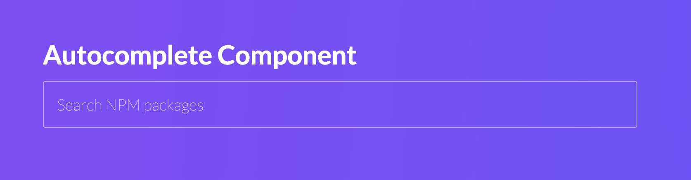

<h2 align="center">Autocomplete Component</h2>

<p align="center">React Autocomplete Input Field</p>



### How to run the application locally?
First of all, you must have NodeJS and NPM installed and configured on your machine.

Then install the dependencies:
```
npm install
```

After the installation is complete, run the application:
```
npm start
```

This will start a webserver on `http://localhost:3000`

### Running the tests
To run all tests, execute:
```
npm run test
```
